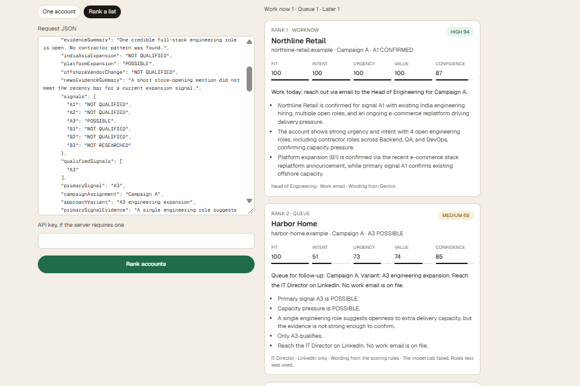
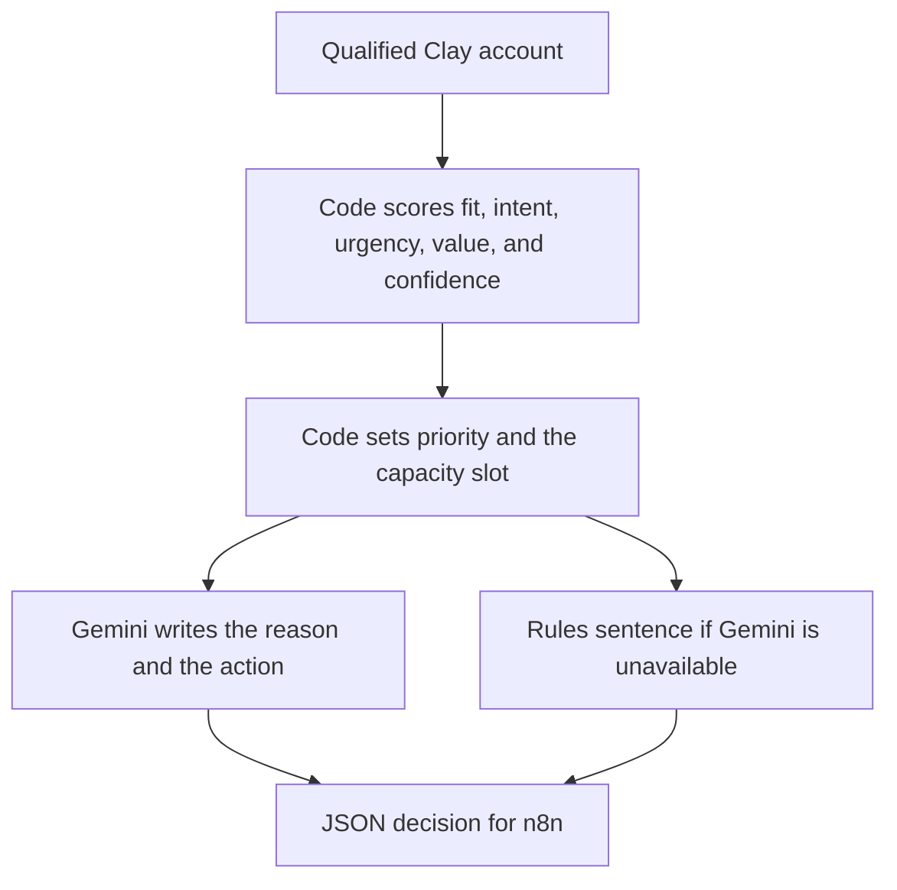
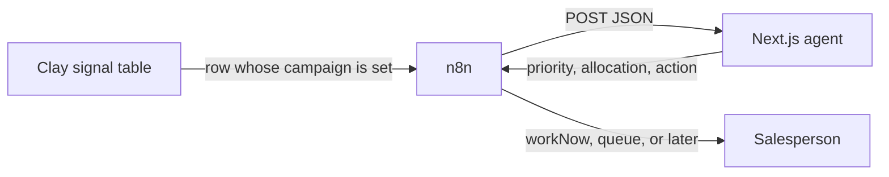
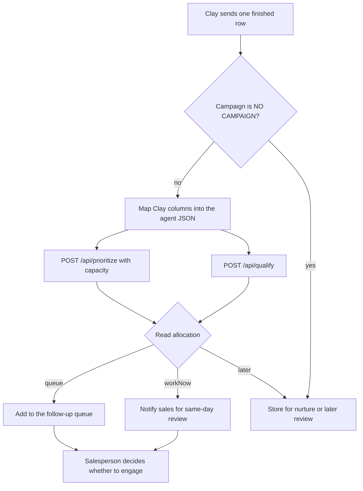

# WSQ Decision Agent

Sales capacity ranking for accounts Clay has already qualified.

The agent reads a WSQ account, keeps the existing A1–B3 signal and campaign, and returns a comparable priority, a capacity slot, and one next action. It does not email, message, or reject a customer. A salesperson makes the final call.



## The problem

WSQ sells extra software-development capacity to retail and consumer companies in the United Kingdom and Saudi Arabia. Clay already does the expensive part of qualification:

1. Build the ICP universe (UK or Saudi Arabia, 51–500 employees, retail or consumer goods).
2. Collect hiring and news evidence.
3. Turn that evidence into six deterministic signals, A1 through B3.
4. Assign a primary signal, a campaign, a variant, and the evidence behind them.
5. Find a decision-maker only after a company earns a campaign.

That funnel is working. A production search still leaves more qualified accounts than the sales team can work in a week. A static lead score, or each rep’s separate judgment, does not say which of those good accounts should be first, or why.

The question this agent answers is:

**Out of the accounts that already have a campaign, which ones should sales work first, given a fixed number of slots?**

## What the agent solves

| Clay already decided | The agent adds |
| --- | --- |
| ICP fit was researched | A comparable fit score, including country and size |
| A1–B3 status and the primary signal | Signal strength, without overturning a CONFIRMED or NOT QUALIFIED result |
| Capacity pressure and the evidence text | Urgency and confidence based on that evidence |
| Campaign and approach variant | The same campaign and variant, passed through unchanged |
| A contact title and whether a work email exists | The channel: work email, LinkedIn, or no contact yet |
| | `workNow`, `queue`, or `later`, based on team capacity |
| | A short evidence list and one recommended action |

`NOT RESEARCHED` stays incomplete research. It is not treated as a rejection. `NO CAMPAIGN` never takes a sales slot, even if another field looks strong. A missing work email does not remove the account. It changes the channel to LinkedIn, which matches the WSQ process.

## How a decision is made



The number is calculated in TypeScript from fixed weights. The same account always gets the same `priorityScore`. Gemini does not invent the score, the signal status, or the campaign. It explains the allocation using only the fields that were sent. If that call fails, the score is unchanged and a rules sentence is returned instead.

Priority bands:

- **high** at 0.72 and above, when at least one signal is CONFIRMED and the account is inside the ICP
- **medium** at 0.48 and above, including accounts that are only POSSIBLE
- **low** below that, and every `NO CAMPAIGN` row

`POST /api/prioritize` then applies capacity. Only the top qualified accounts, up to the slot count, are marked `workNow`. Further qualified accounts are `queue`. Everything else is `later`.

## Architecture



Clay answers: what do we know, and which campaign did the formulas assign?

The agent answers: what does that mean for a team with limited slots?

n8n answers: which operational path should run after the decision?

The salesperson answers: do we actually engage, and how?

## How n8n uses this agent

n8n is the adapter. Clay does not call the model. n8n receives the Clay row, renames columns into the agent contract, and routes the response.



Use `/api/qualify` when Clay finishes one row and n8n should react immediately. Use `/api/prioritize` when n8n has collected the week’s qualified rows and must give only `capacity` of them a slot. A JSON array of accounts is accepted and uses capacity 12.

Send `Authorization: Bearer <PRIORITIZE_API_KEY>` when that key is set. Production refuses the request if the key is missing.

Columns such as `Company Name`, `capacity_pressure`, `Primary Signal`, and `A1` are accepted and normalized. Personal names, email addresses, and LinkedIn URLs are not required. Send the job title and whether a work email was found.

Fields n8n should branch on:

| Field | Values | Use |
| --- | --- | --- |
| `allocation` | `workNow`, `queue`, `later` | Which workflow runs |
| `priority` | `high`, `medium`, `low` | How strong the account is |
| `priorityScore` | `0` to `1` | Sort a list |
| `campaign` | Clay’s campaign name | Keep the approved sequence |
| `approachVariant` | Clay’s variant | Keep the approved variant |
| `channel` | `email`, `linkedin`, `none` | Which outreach path exists |
| `recommendedAction` | One sentence | What the rep sees |
| `pursue` | `true` or `false` | `false` when the campaign is NO CAMPAIGN |

Approved LinkedIn and email sequences stay in the campaign tools. This agent does not write them.

## What had to be solved to make the ranking trustworthy

**The model cannot be the scorer.** Early drafts let the model emit fit, intent, and the priority number. Those numbers are not comparable from one call to the next, so a list of “high” accounts cannot be sorted into a real weekly capacity. The score, the band, and the slot are now code. Gemini only writes the note.

**Campaign entry was already decided.** The WSQ formulas assign A1–B3, the primary signal, and the campaign. Letting a model freely re-qualify an account would fight that audit trail. The agent treats those fields as facts and ranks inside them.

**There was no exported JSON row.** The live table and the process description were enough to define a stable contract. n8n maps Clay’s column names into that contract, so a renamed column does not require a new model prompt.

**Gemini had to be pinned to a model that returns JSON.** New API keys cannot call `gemini-2.5-flash`. `gemini-3.8-flash` answers, but its default reasoning used up the output budget and the JSON parse failed. This call disables that reasoning budget. A failed model call still returns the coded score and a rules sentence, which is what the Harbor Home card shows in the screenshot above.

## Run locally

```bash
npm install
npm run dev
```

Open http://localhost:3000. **Rank a list** uses one capacity slot so Northline Retail is work now, Harbor Home is queued, and Desert Pantry stays later.

Copy `.env.example` to `.env` and set:

- `GOOGLE_GENERATIVE_AI_API_KEY` for Gemini wording
- `GEMINI_MODEL` if you need a model other than `gemini-3.8-flash`
- `PRIORITIZE_API_KEY` before any deployment n8n can reach

```bash
npm test
```

The tests cover the ranking rules without calling Gemini.

## API

`GET /api/qualify` and `GET /api/prioritize` return a short description and an example body.

`POST /api/qualify` scores one account.

`POST /api/prioritize` ranks a list:

```json
{
  "capacity": 12,
  "accounts": []
}
```
